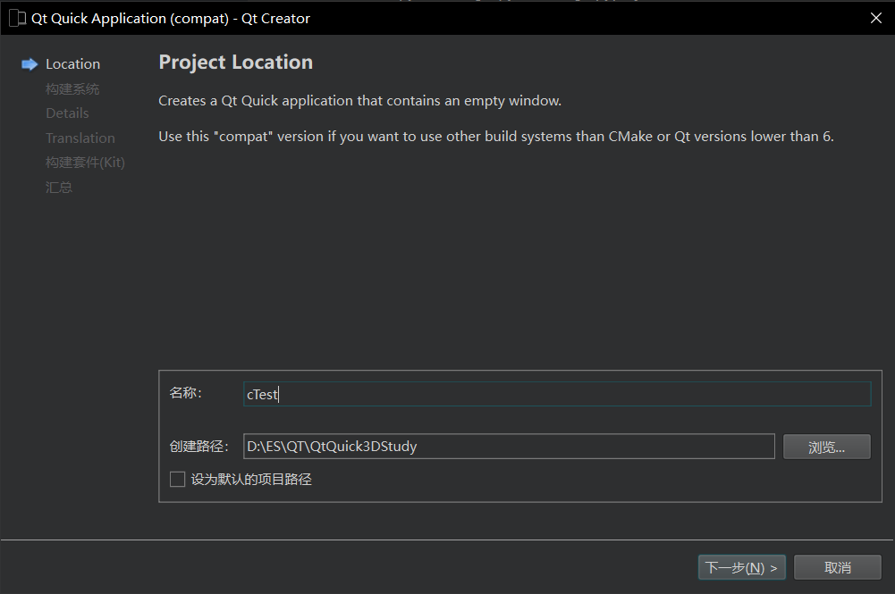
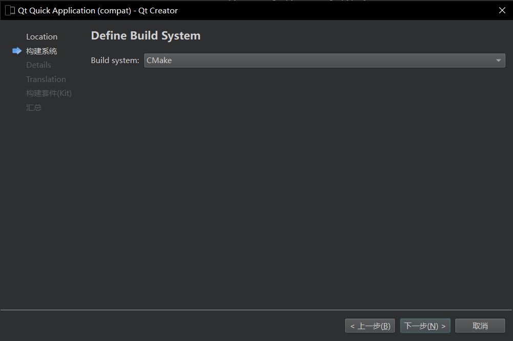
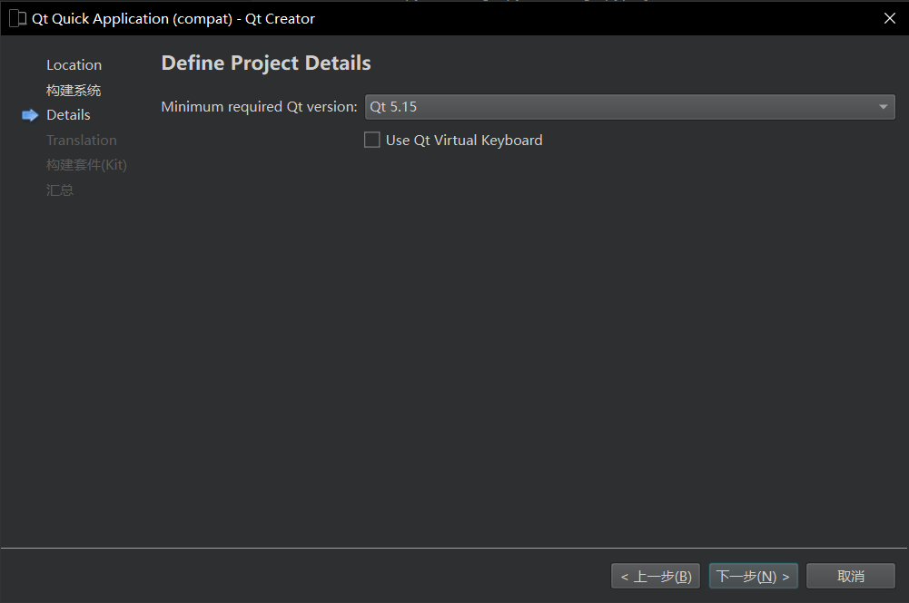
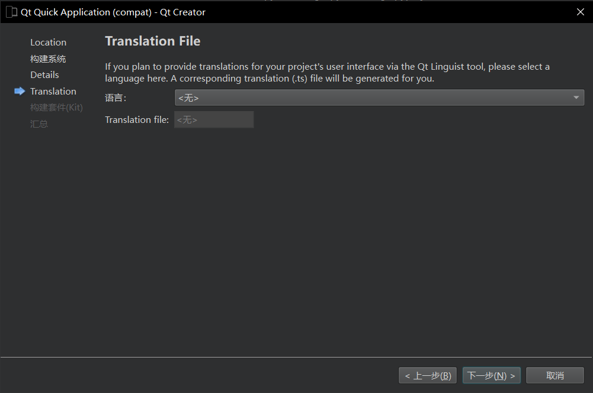
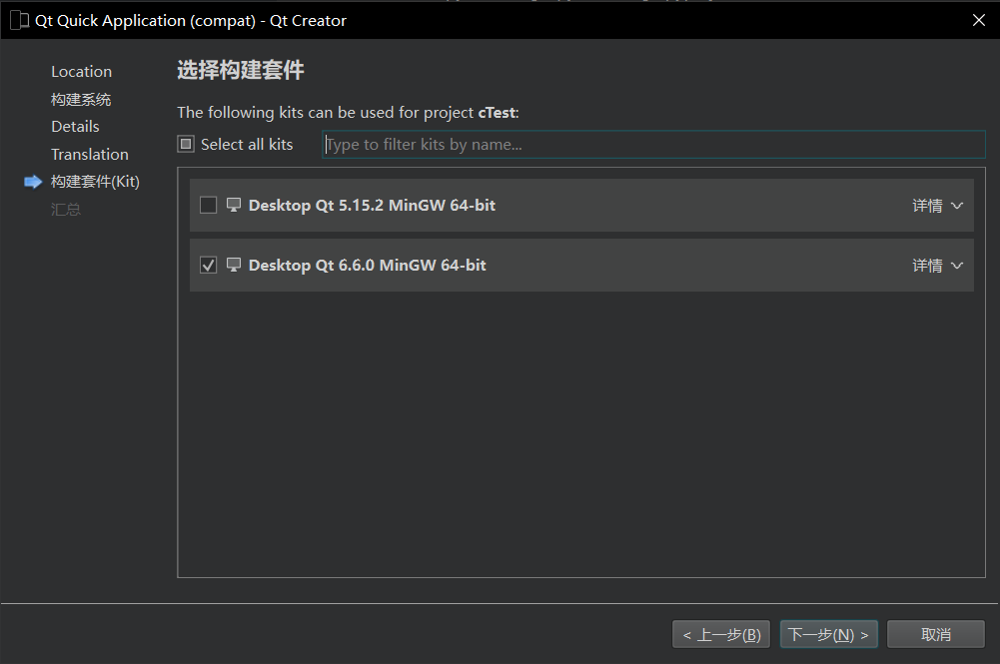
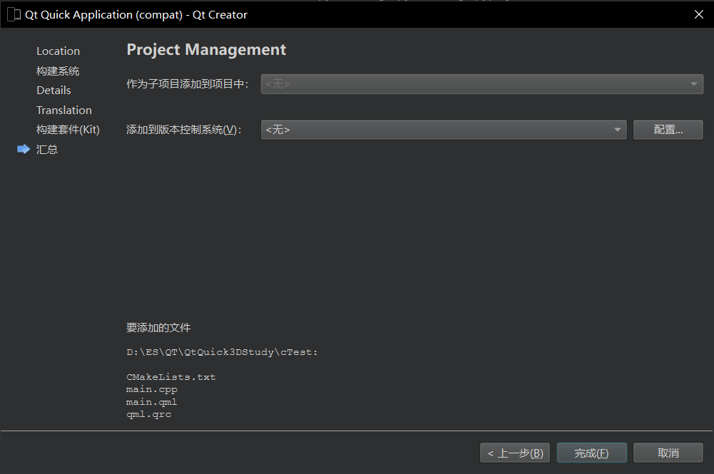
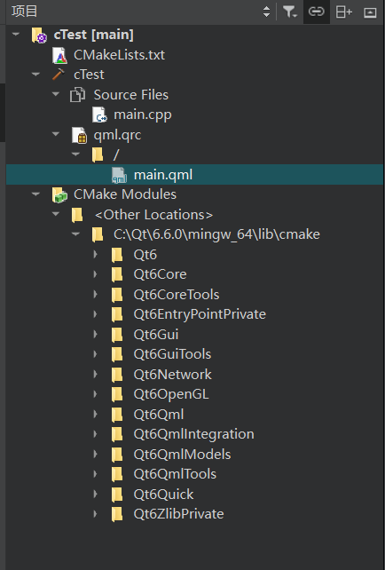
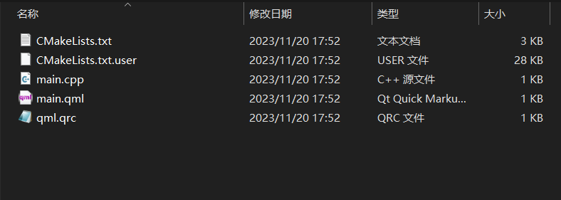
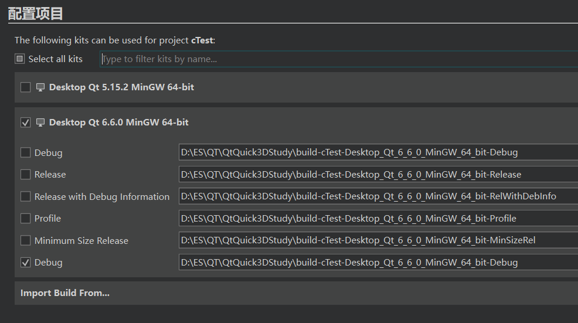

## 项目创建与运行

1. 创建项目

这里选择compat，项目结构会更简单，具体区别在后续展现

构建系统选择Cmake，Qt官方目前也推荐使用Cmake了

这里只是最小版本

这里可选可不选，暂时不用

这里选择 Qt 6.6.0 MinGW 64-bit

版本管理系统，可以选择git，也可自行管理

2. 构建项目
3. 运行项目

如果没有意外，可以看到下面的画面

## 项目文件结构分析

项目结构

文件结构

CmakeList.txt 为 Cmake 文件
CmakeList.txt.user 是用户的配置文件，定义了一些构建与运行的配置

main.cpp 是主程序文件
main.qml 是主界面文件
qml.qrc 是Qt资源管理文件，管理图片音频等文件

因为使用了Cmake，所以文件夹内没有Qt项目文件，再次打开项目参考下面

## 项目打开

打开项目的时候选择 CmakeList.txt 文件即可

如果环境发生改变或者CmakeList.txt.user不存在，打开时需要重新配置

