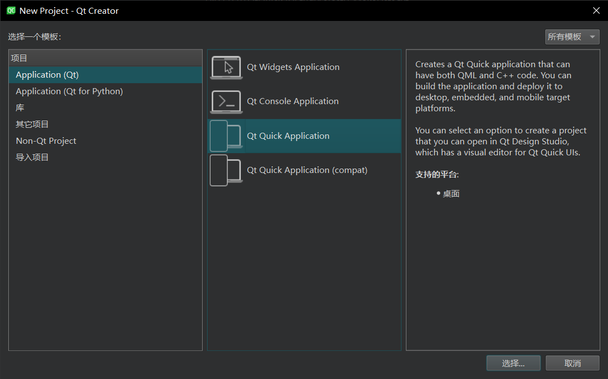
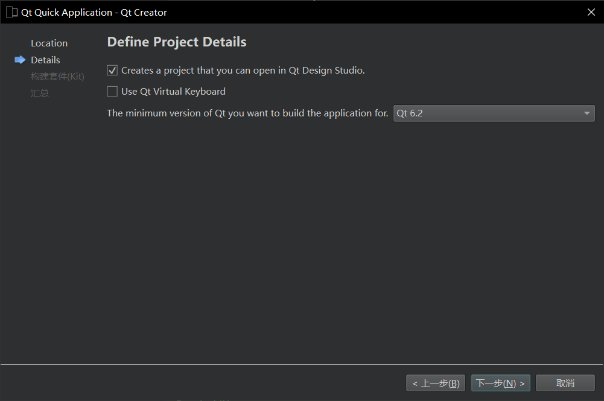
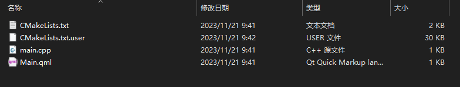
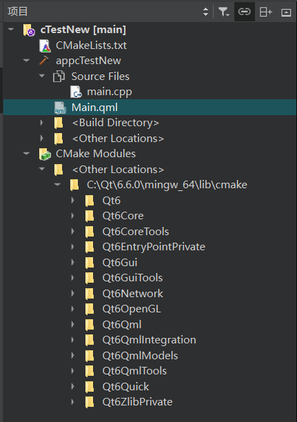
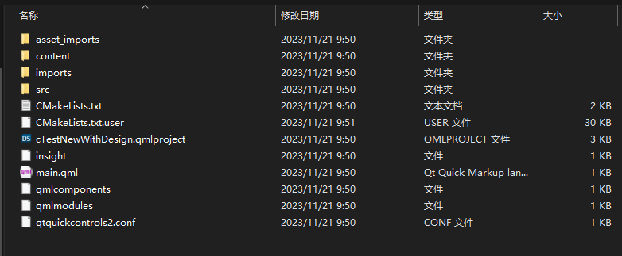
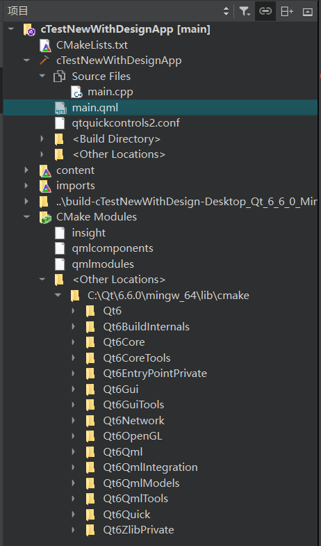
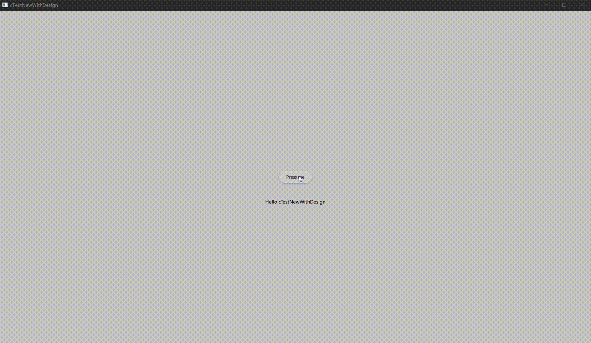

项目创建步骤与[1.cTest](./1.cTest)基本一致

在选择模板的时候不选择compat



构建系统选项已经移除，默认使用Cmake

在Details中多了一个与Qt Design Studio相关的选项，勾选与不勾选的差别在下面展示



## 不勾选

在不勾选的情况下，文件结构与之前的基本一致，少了一个qml.qrc文件




项目结构也变得不一样了，没有qml.qrc文件，取而代之的是多了两个文件夹



分析CmakeLists.txt文件可知，qml文件管理被放在了该文件中

```Cmake
qt_add_qml_module(appcTestNew
    URI cTestNew
    VERSION 1.0
    QML_FILES Main.qml
)
```

综合分析，在新版本中所有的项目文件均由Cmake系统管理

运行结果与之前一致，得到一个简单的窗口


## 勾选

根据提示，勾选之后会创建一个Qt Design Studio项目

勾选之后，项目和文件结构都变得更加复杂了

### 文件结构

文件中除了基本的文件，也多了一个qmlproject文件，可以使用Qt Design Studio打开



### 项目结构



### 运行结果

得到一个可以交互的窗口


