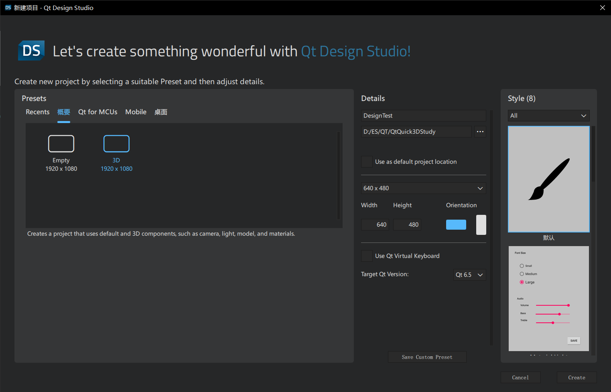
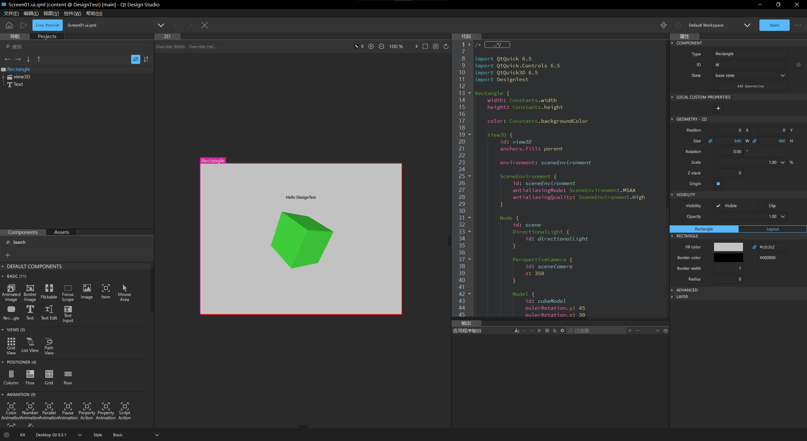
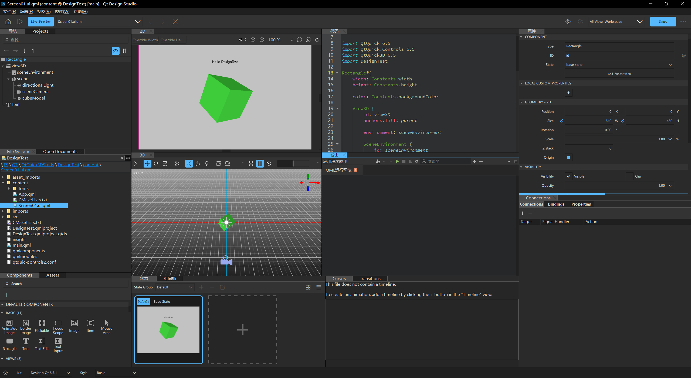
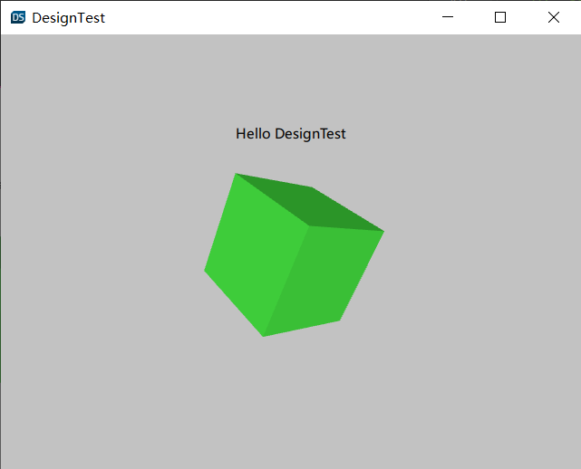
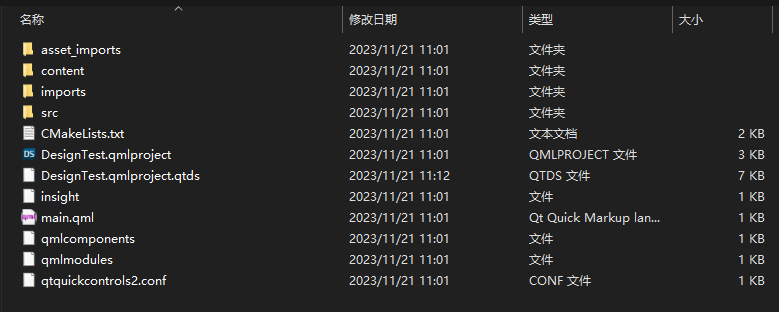
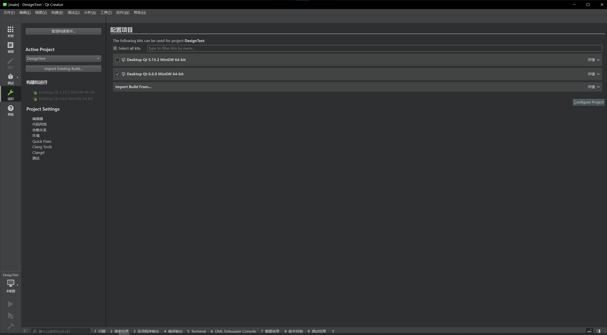
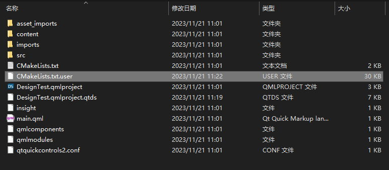
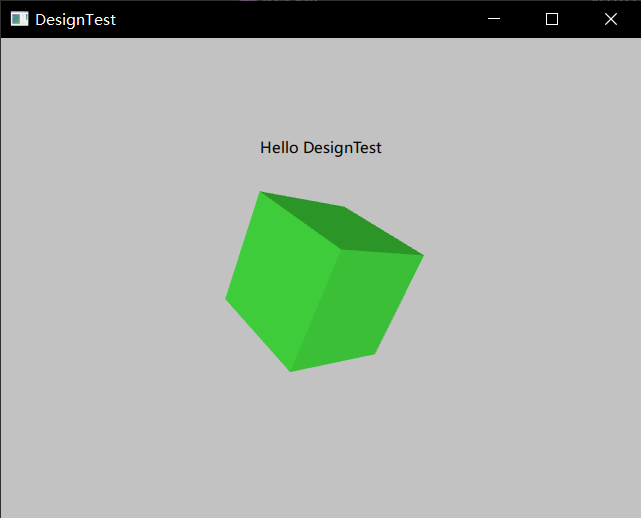

## 项目创建与运行

可以选择模板，更改大小，方向，风格，然后创建项目

选择3D会自动帮你创建一个带3D场景的项目，其中有一个正方形

默认的布局

左边是管理窗口，可以拖拽添加模块，中间是预览窗口，右边是代码和属性窗口

点击右上角可以切换布局

所有的可操作窗口

运行结果

## 结构分析

通过此方法创建的项目与[3.cTestNew](./3.CTestNew.md)中勾选Qt Design Studio相关的选项后创建的项目的结构基本一致

### 文件结构

文件中少了一个CMakeLists.txt.user，在使用Qt Creator打开项目并配置后会出现

## 项目打开

创建的项目除了可以使用Qt Design Studio打开之外，也可以使用Qt Creator打开，下面介绍如何打开

使用Qt Creator打开项目，选择项目文件夹根目录下的CMakeLists.txt文件，会出现下面的配置窗口，配置好后将会打开项目

同时，项目目录下会出现CMakeLists.txt.user文件

构建运行，会得到一样的结果，除了图标和颜色略有不同

