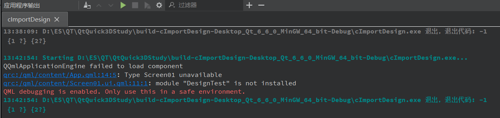
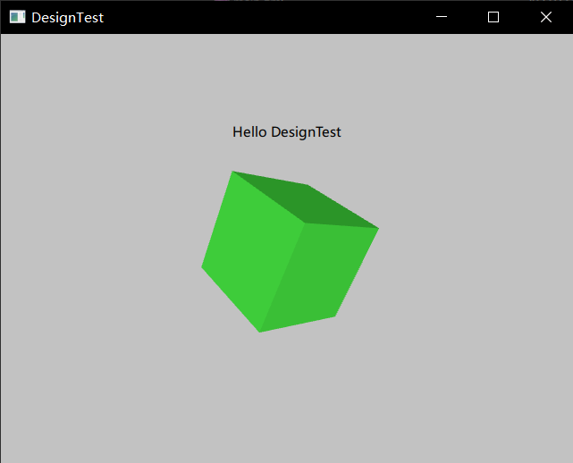

新版本中项目文件全部放在了一起，见

- [3.cTestNew](./3.cTestNew.md)
- [4.designTest](./4.designTest.md)

这里测试前后端分离，即使用Qt Design Studio设计前端和交互逻辑，C++写后端，处理数据

## 项目创建

### 1. Qt Creator

按照[1.cTest](./1.cTest.md)创建项目，得到基本项目框架，或者使用之前创建好的项目

这里使用新创建的项目


### 2. Qt Design Studio

按照[4.designTest](./4.designTest.md)创建项目，得到基本项目框架，或者使用之前创建好的项目

这里使用之前创建的项目

## 文件导入

这里要将Qt Design Studio项目中的部分文件导入到Qt Creator项目中使用

### 文件复制

将Qt Design Studio项目DesignTest文件夹中的前三个文件夹复制到Qt Creator项目
cImportDesign中的qml文件夹(ps:需要先创建该文件夹)内


得到如下的文件结构

```shell
│  CMakeLists.txt
│  CMakeLists.txt.user
│  main.cpp
│  main.qml
│  qml.qrc
│
└─qml
    ├─asset_imports
    │      asset_imports.txt
    │
    ├─content
    │  │  App.qml
    │  │  CMakeLists.txt
    │  │  Screen01.ui.qml
    │  │
    │  └─fonts
    │          fonts.txt
    │
    └─imports
        │  CMakeLists.txt
        │
        └─DesignTest
            │  CMakeLists.txt
            │  Constants.qml
            │  DirectoryFontLoader.qml
            │  EventListModel.qml
            │  EventListSimulator.qml
            │  qmldir
            │
            └─designer
                    plugin.metainfo
```

### qrc管理

在Qt Creator项目选择qml.qrc，右键选择添加现有文件夹


勾选qml文件夹


成功添加后可以在项目结构中看到增加的文件


## 代码修改

此时直接构建运行，还是原来的窗口，所以需要更改代码

找到main.cpp文件，将13行修改为下面的内容

```c++
    const QUrl url(QStringLiteral("qrc:/qml/content/App.qml"));
```

或者直接复制下面的代码替换

```c++
#include <QGuiApplication>
#include <QQmlApplicationEngine>


int main(int argc, char *argv[])
{
#if QT_VERSION < QT_VERSION_CHECK(6, 0, 0)
    QCoreApplication::setAttribute(Qt::AA_EnableHighDpiScaling);
#endif
    QGuiApplication app(argc, argv);

    QQmlApplicationEngine engine;
//    const QUrl url(QStringLiteral("qrc:/main.qml"));
    const QUrl url(QStringLiteral("qrc:/qml/content/App.qml"));
    QObject::connect(&engine, &QQmlApplicationEngine::objectCreated,
        &app, [url](QObject *obj, const QUrl &objUrl) {
            if (!obj && url == objUrl)
                QCoreApplication::exit(-1);
        }, Qt::QueuedConnection);
    engine.load(url);

    return app.exec();
}

```

重新构建运行，在应用程序输出窗口得到下面的错误输出


直接点击蓝色部分跳转到错误处，或者自行打开App.qml文件

将报错处(第5行)修改为下面的内容

```qml
import "qrc:/qml/imports/DesignTest"
```

或者直接复制下面的代码替换

```qml
// Copyright (C) 2021 The Qt Company Ltd.
// SPDX-License-Identifier: LicenseRef-Qt-Commercial OR GPL-3.0-only

import QtQuick 6.5
import "qrc:/qml/imports/DesignTest"

Window {
    width: mainScreen.width
    height: mainScreen.height

    visible: true
    title: "DesignTest"

    Screen01 {
        id: mainScreen
    }

}


```

重新构建运行，在应用程序输出窗口得到下面的错误输出



同上，修改错误处代码为

```qml
import "qrc:/qml/imports/DesignTest"
```

由于Screen01.ui.qml文件的特殊性，会跳转到设计窗口，不用担心

重新构建运行，在应用程序输出窗口得到下面的错误输出


同样的跳转到错误处，将错误内容注释，根据内容推测，跟字体相关，暂时不用

```qml
pragma Singleton
import QtQuick 6.5
//import QtQuick.Studio.Application

QtObject {
    readonly property int width: 640
    readonly property int height: 480

    property string relativeFontDirectory: "fonts"

    /* Edit this comment to add your custom font */
    readonly property font font: Qt.font({
                                             family: Qt.application.font.family,
                                             pixelSize: Qt.application.font.pixelSize
                                         })
    readonly property font largeFont: Qt.font({
                                                  family: Qt.application.font.family,
                                                  pixelSize: Qt.application.font.pixelSize * 1.6
                                              })

    readonly property color backgroundColor: "#c2c2c2"


//    property StudioApplication application: StudioApplication {
//        fontPath: Qt.resolvedUrl("../../content/" + relativeFontDirectory)
//    }
}

```

## 运行结果

再次构建运行，得到应用窗口，与此前[4.designTest](./4.designTest.md)结果一致


