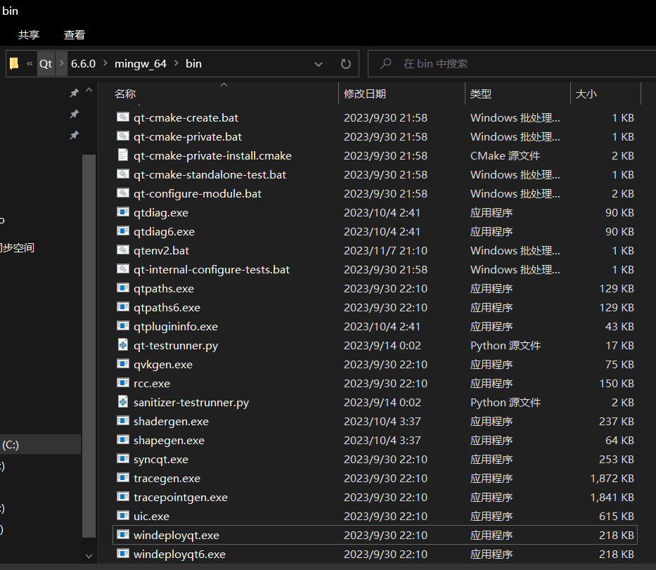
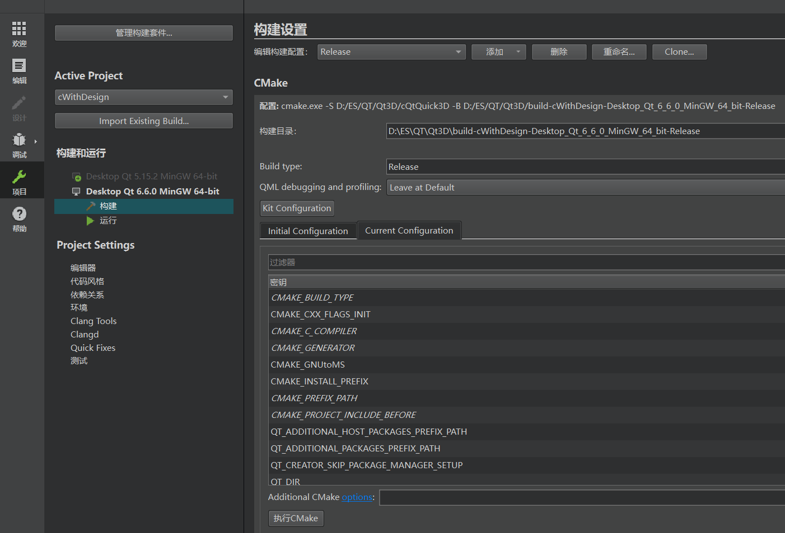
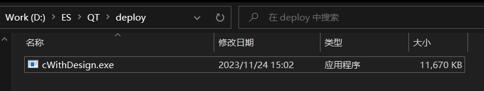
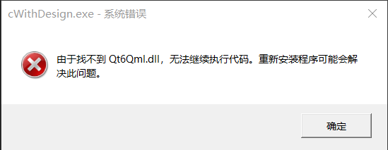
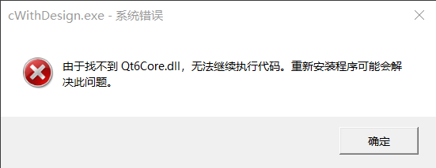
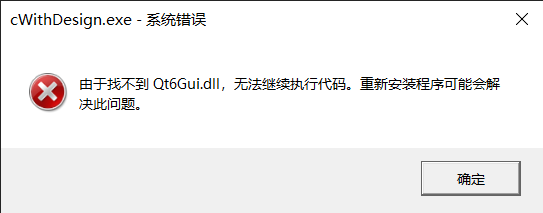
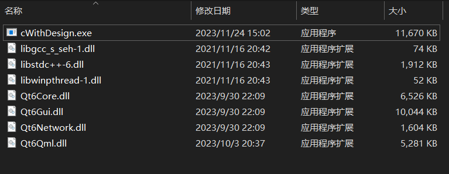
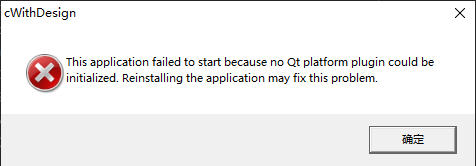
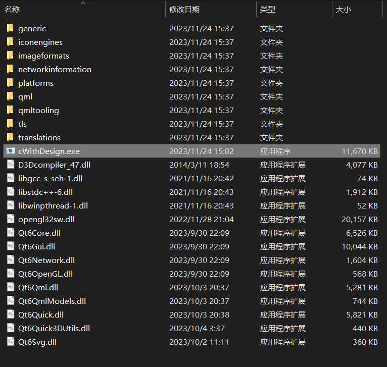

我们编写一个应用程序的最终目的就是打包并发布给其他人使用

所以这里开始学习打包发布基于Qt编写的应用程序

实验环境如下

| item| version |
| ---- | ---- |
| Qt | 6.6.0 |
|  Qt Creator | 11.0.3 (Community)  |
| Qt Design Studio | 4.1.0  |
| Kit | MinGW 11.2.0 (64-bit)  |

根据网上经验，Qt官方提供了相关工具[Qt for Windows - Deployment | Qt 6.6](https://doc.qt.io/qt-6/windows-deployment.html)

在Qt安装目录的对应文件夹下



## 步骤

### 构建Release

首先将构建切换至Release

然后构建运行，确保能正确运行

### 手动打包

找到构建Release的文件夹，并拷贝生成的xxx.exe文件

文件夹和文件可以从项目窗口中找到





此时直接双击运行软件，将会提示缺少各种xxx.dll







手动拷贝各种缺少的xxx.dll后，还会有错误





所以手动打包过于麻烦，决定使用工具自动打包

### 自动打包

默认没有添加环境变量，所以直接执行windeployqt无法识别，解决方法是将上面展示windeployqt的bin文件夹添加到环境变量

然后执行指令

```shell
windeployqt .\cWithDesign.exe
```

文件夹内将会多出很多文件，此时双击执行应用程序，就能执行了



如果要求不高，此时已经可以压缩发送给别人使用了

ps：根据提示，如果使用了Qt Quick，还需要将qml路径增加到指令中

```shell
Usage: C:\Qt\6.6.0\mingw_64\bin\windeployqt.exe [options] [files]
Qt Deploy Tool 6.6.0

The simplest way to use windeployqt is to add the bin directory of your Qt
installation (e.g. <QT_DIR\bin>) to the PATH variable and then run:
  windeployqt <path-to-app-binary>

If your application uses Qt Quick, run:
  windeployqt --qmldir <path-to-app-qml-files> <path-to-app-binary>

Options:
  -?, -h, --help                      Displays help on commandline options.
  --help-all                          Displays help, including generic Qt
                                      options.
```

