## Blender

首先使用Blender创建数字人模型，然后导出为fbx格式

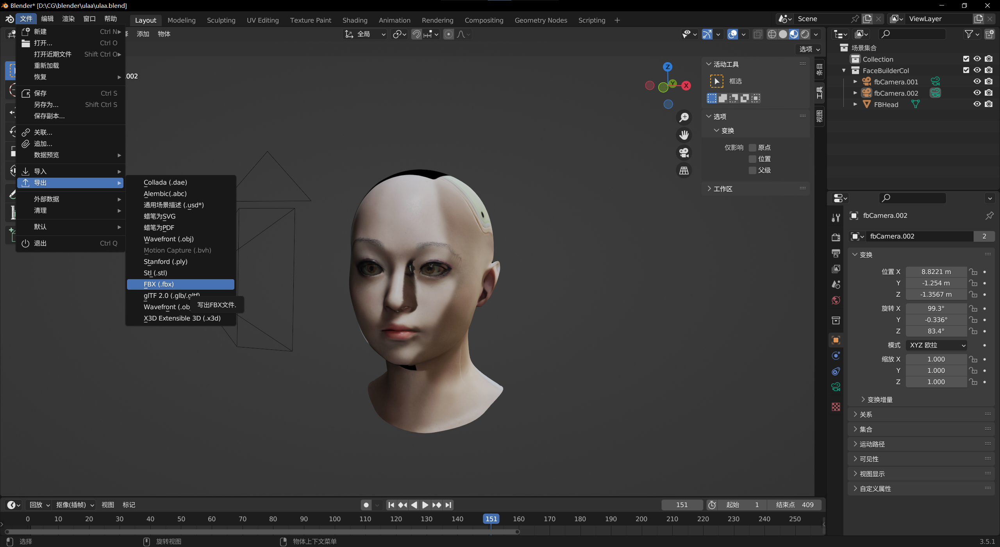


## Qt Design Studio

然后使用Qt Design Studio创建demo工程，得到下面的运行结果

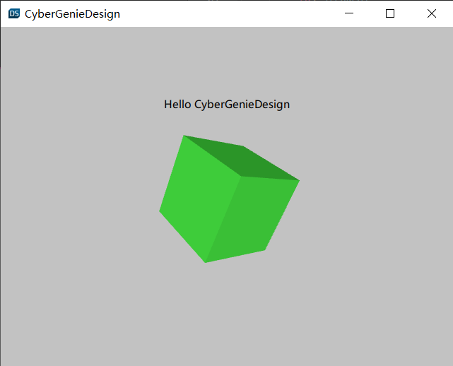

然后左下角切换到Assets窗口，点击+符号，导入从Blender导出的模型

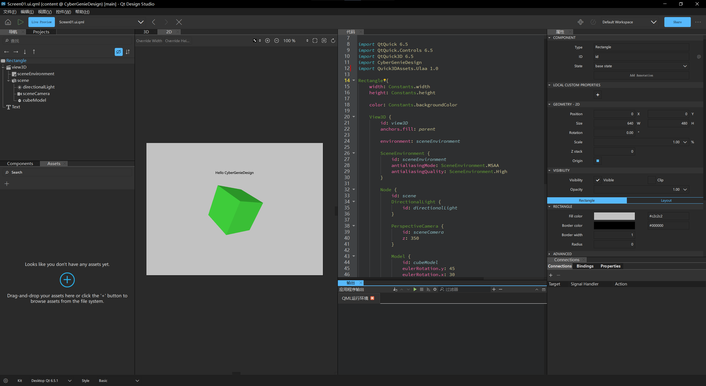

导入成功后，可以切换到Components窗口，看到多出来的MY 3D COMPONENTS中有导入的模型，双击模型可以打开查看详细信息

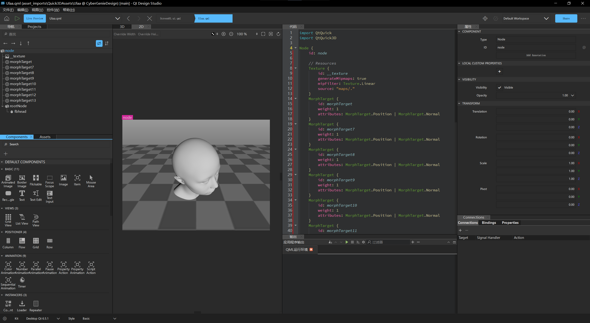

其中的morphTarget就是识别出来的Blender Shape（也叫形态键Shape Key）

改变这个的值可以控制模型的形态发生改变，效果在Blender中已经做好

直接修改代码窗口中的代码，在第6行增加下面的内容

```qml
    property alias morphTarget7Weight: morphTarget7.weight
    property alias morphTargetWeight: morphTarget.weight
```

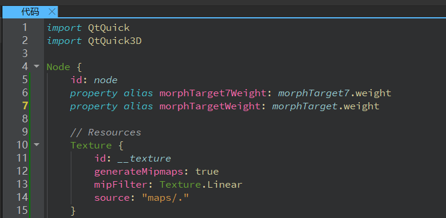

这里可以理解为起了一个别名，并声明之后可以在外部使用，具体含义需要学习QML语法

在左上角切换回Screen01.ui.qml

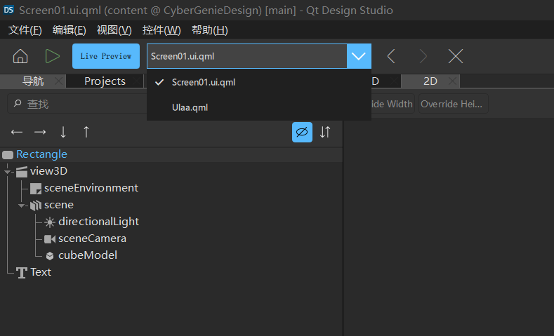

然后使用鼠标左键点住MY 3D COMPONENTS中的模型，拖到view3D下的scene中，之后中间的界面便会出现导入的模型

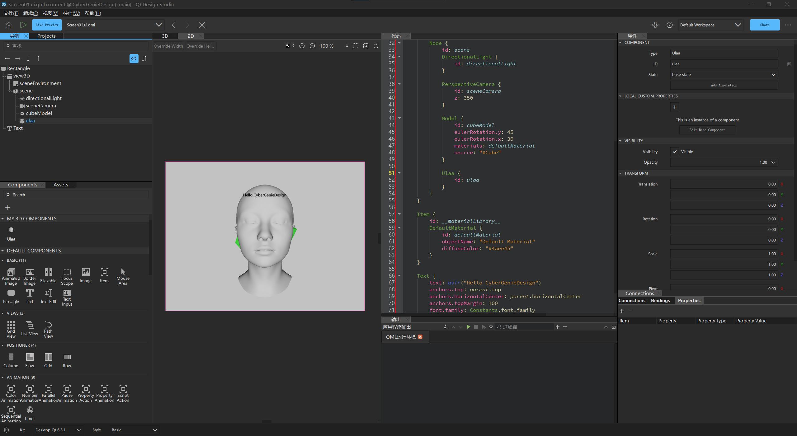

调整模型的旋转，将脸的角度调的正常些


在左边导航栏中选中模型，在右边属性窗口往下滑动窗口，找到TRANSFORM，其中各种属性参数都可以直接调整，也可以在代码中写eulerRotation.x: 10，代表x旋转10度

从这里也可以看出来，Qt Design Studio有一种类似于QML的IDE的感觉，可以很方便的不用直接写代码而控制UI的各种属性参数

接下来加入两个Slider到Rectangle中，可以在Components窗口找到，如果熟悉QML，也可以直接用代码写

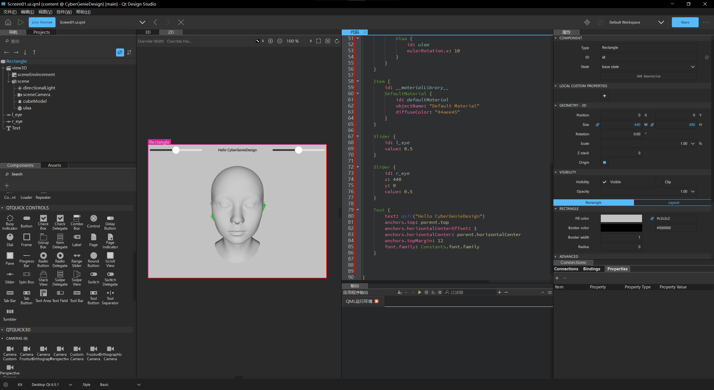

可以调整名字和位置，直接拖动即可，或者在代码中指定位置

接下来找到代码中的模型位置，增加代码

```qml
morphTarget7Weight: l_eye.value
morphTargetWeight: r_eye.value
```

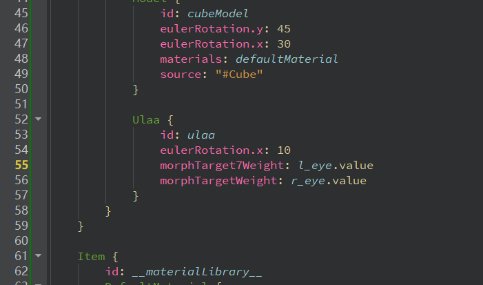

这里是将左右眼睛的控制绑定在两个Slider上

也可以直接在Connections窗口的Bindings中直接添加

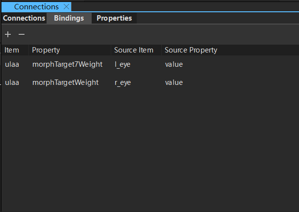

## 运行结果

此时点击运行，就可以使用两个Slider分别控制模型的左右眼睛

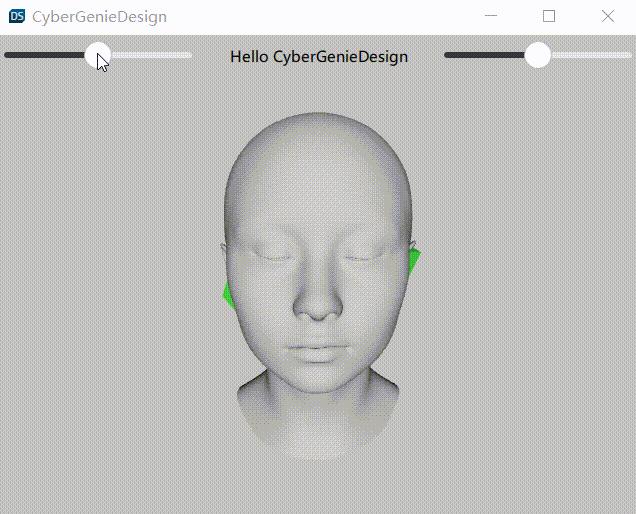

